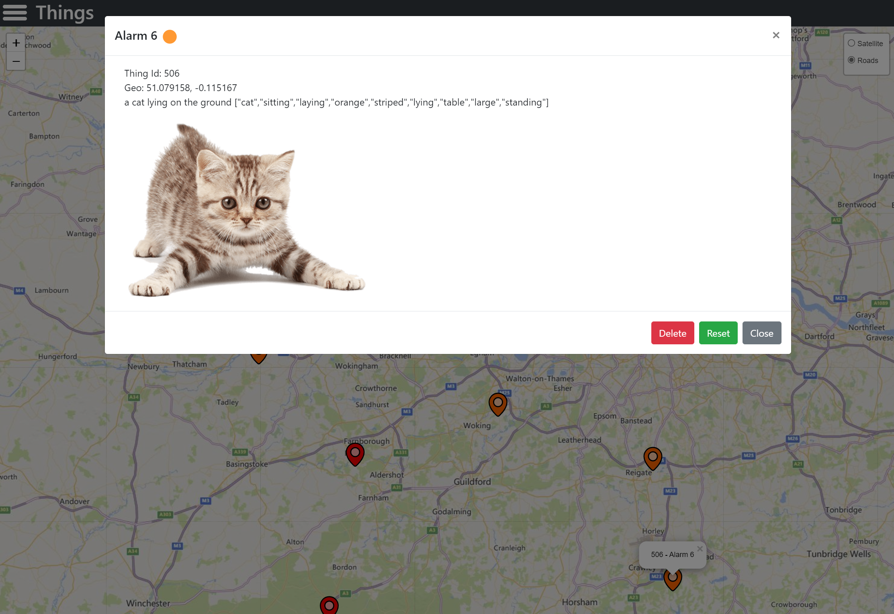
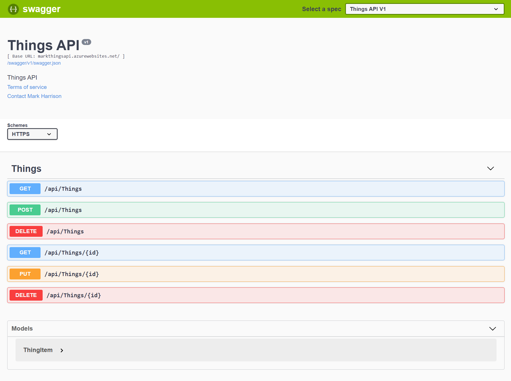
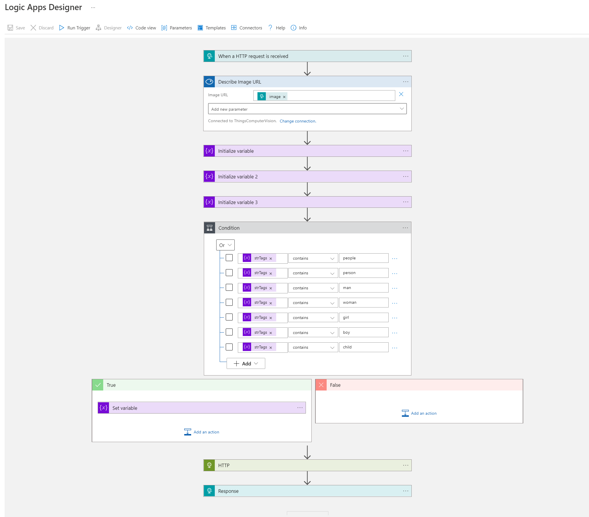

# Azure AppDev Challenge

This two-day event is a challenge-oriented hack where participants will be assigned to teams and attempt to solve a series of tasks to build up a complete working solution in Azure. The event is intended for technical architects and developers who want to pick up new skills, learn by being hands-on and work with others to share skills & ideas to collectively steer the team in the right direction.

18 September 2019 ... updated 11 January 2022

