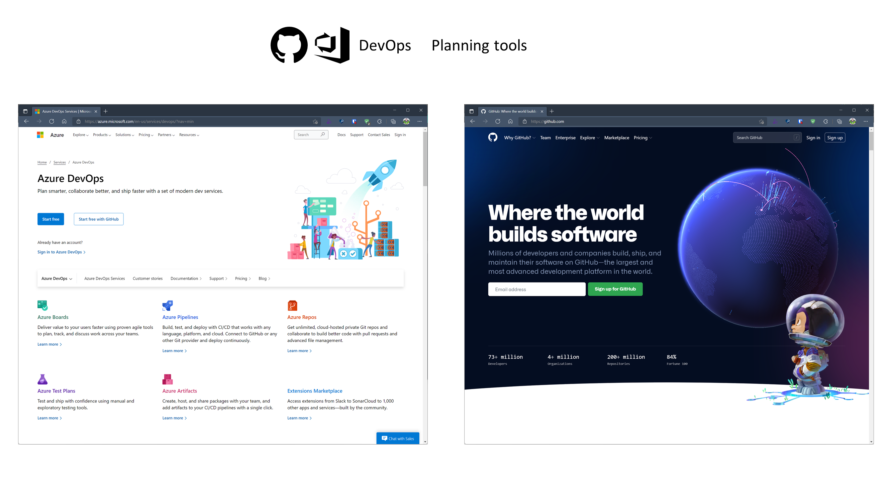

# Azure AppDev Challenge

## Day 1 - Task 1

- Team introductions
  - What are the team members skills?
  - What languages / platforms / dev tools will the team use? Anything is allowed.

- Decide on team objectives and strategy
  - What are the aspirations?

- Team proctor to ensure everyone is added to the team’s Azure subscription
  - See Appendix F

- Develop a project plan / strategy
  - Record required Features / Backlogs / Tasks in planning tool
  - Assign Tasks to team members

Useful Resources:

- <https://docs.microsoft.com/azure/devops/boards>
- <https://docs.github.com/en/issues/organizing-your-work-with-project-boards>