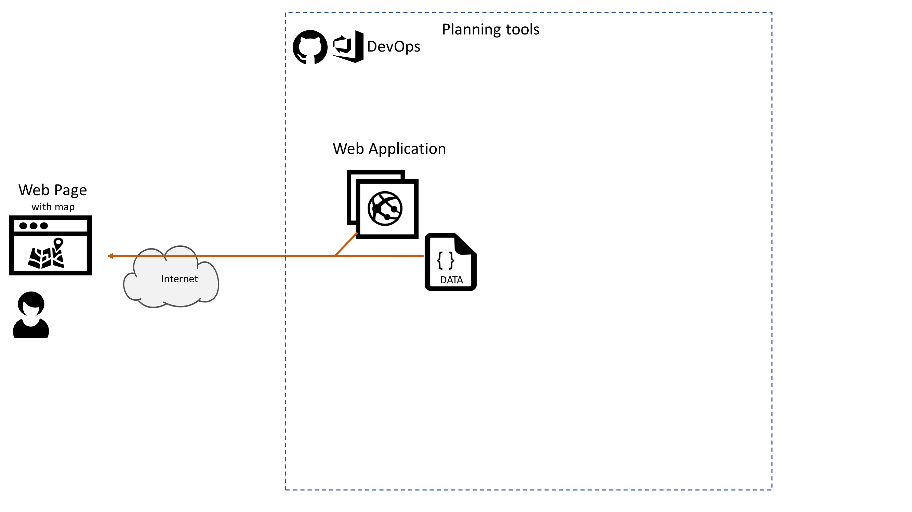

# Azure AppDev Challenge

## Day 1 - Task 3

- Create a Web Application hosted in Azure
  - Use the assets from Task 2 to display the map
- Store the code in a source code repository – such as Azure Repos, GitHub, etc.

Useful Resources:

- <https://docs.microsoft.com/azure/app-service/>
- <https://docs.microsoft.com/azure/devops/repos/>
- <https://docs.microsoft.com/azure/devops-project/>
- <https://github.com/>