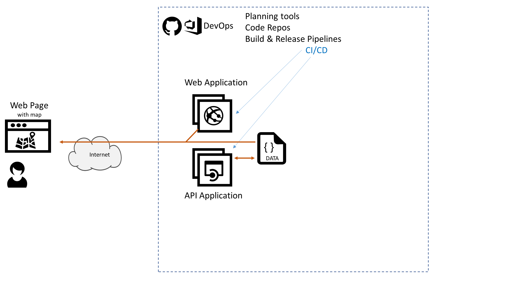

# Azure AppDev Challenge

## Day 1 - Task 5

- Create an API Application hosted in Azure
- Initially support API operation:
  - GetMap … return the hardcoded dataset from earlier as a JSON payload
- Later support API operations:
  - GetMapByDeviceId
  - UpdateMapByDeviceId
- Get the API Application to generate a Swagger document

Useful Resources:

- <https://docs.microsoft.com/azure/app-service/app-service-web-tutorial-rest-api>
- <https://docs.microsoft.com/aspnet/core/tutorials/first-web-api>
- <https://docs.microsoft.com/aspnet/core/tutorials/web-api-help-pages-using-swagger>