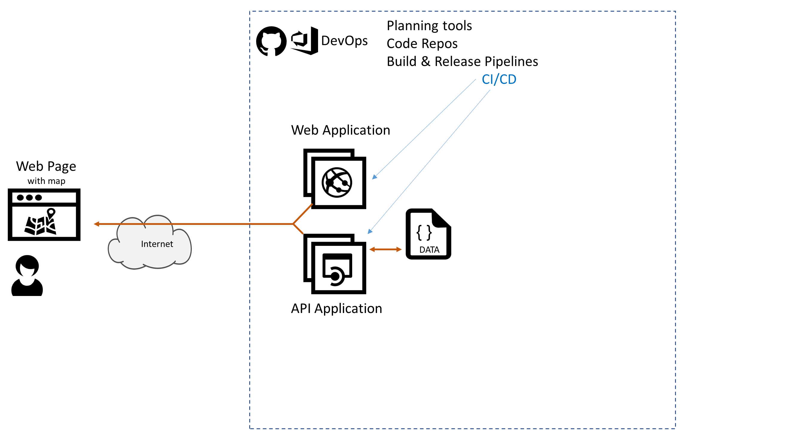

# Azure AppDev Challenge

## Day 1 - Task 6 

- Amend the Web Application so that the web page now gets map pin data from the API Application
- JavaScript in the web page will currently need to refresh / poll for map updates – use AJAX to update page without a page reload

Useful Resources:

- <https://www.w3schools.com/xml/ajax_intro.asp>