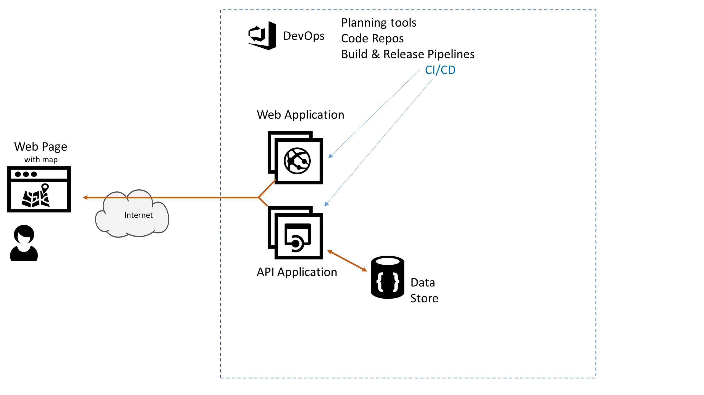

# Azure AppDev Challenge

## Day 1 - Task 7 

- Create a datastore
  - e.g. Azure Table Storage … but many other options available
- Use the datastore to store current state of the remote alarms
- Amend API Application to use the datastore for alarm status data

Useful Resources:

- <https://docs.microsoft.com/azure/storage/>
- <https://docs.microsoft.com/en-gb/azure/sql-database/>
- <https://docs.microsoft.com/en-gb/azure/mysql/>
- <https://docs.microsoft.com/en-gb/azure/cosmos-db/>
- <https://docs.microsoft.com/en-gb/azure/postgresql/>
- <https://docs.microsoft.com/en-gb/azure/redis-cache/>

