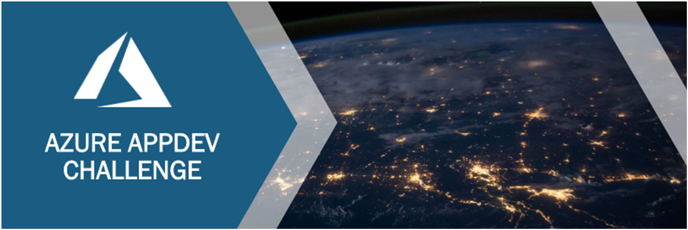

# Azure AppDev Challenge

18 September 2019 ... updated 11 January 2022

## Introduction

This two-day event is a challenge-oriented hack where participants will be assigned to teams and attempt to solve a series of tasks to build up a complete working solution in Azure. The event is intended for technical architects and developers who want to pick up new skills, learn by being hands-on and work with others to share skills & ideas to collectively steer the team in the right direction.

The scenario to be built will provide opportunities to learn about:

- Azure application services

- DevOps CI/CD pipelines

- API apps / Microservices

- Logic Apps / Functions / Serverless

- Containers

- Orchestrators … Kubernetes, Service Fabric, others

- Cognitive services

- Mapping services

- Application telemetry / operations monitoring

- … and a lot more

Teams will ideally comprise of between 3 and 5 people, plus a proctor who will be an Azure technical specialist to help ensure the project makes good progress.

## Prerequisites

Attendees should bring a laptop with the development tools of their choice. How the solution is implemented is up to the team members – it can use any technologies, languages, platforms tools, etc.

An Azure subscription should be provided for each team.

## The Challenge

This document will contain a set of requirements for a suggested scenario.

- Day 1 - follow through the prescriptive set of tasks to build up the solution and achieve an end to end solution

- Day 2 – enhance solution in the areas of interest to the team and where it provides an opportunity to learn. Some suggestions are given but anything goes!

There will be frequent ad-hoc / scheduled ‘Show & Tell’ sessions to share what each team are doing / lessons learnt / demonstrate what has been achieved.

The winning team will be the one that which provides the most complete / innovative solution and shares the most learnings.

But hopefully everyone wins from the experience.
