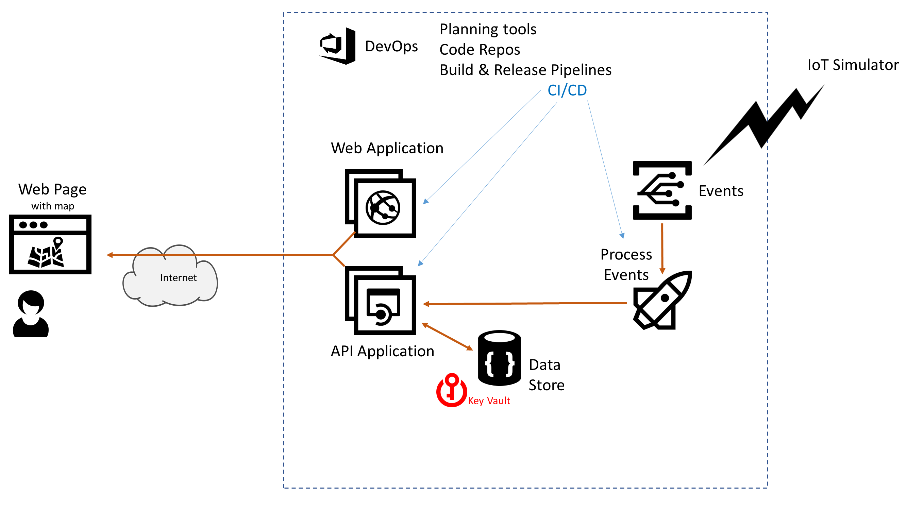

# Azure AppDev Challenge

## Day 2 - Protect Secrets 

- Ensure that connection strings / secrets - e.g. to access the datastore - are not stored in code
  - Use Azure Key vault to store secrets
- Implement Managed Service Identities – so the Key Vault trusts the AppService
- Use environment variables (Azure AppService application Settings) to get the secrets from Key Vault

Useful Resources:

- <https://docs.microsoft.com/azure/key-vault/>
- <https://github.com/markharrisonuk/Setup_AppSvcKV>
- <https://docs.microsoft.com/azure/key-vault/tutorial-net-windows-virtual-machine>
