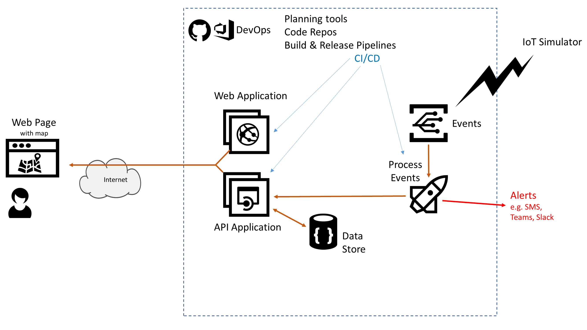

# Azure AppDev Challenge

## Day 2 - Additional Workflow 

- Enhance the Workflow to include additional functionality
  - For example, update event processing to implement notifications e.g. SMS messages, Teams webhook, Dynamics Field Service connector.
- Investigate the numerous Connectors available with Logic Apps
- Alternatively investigate Azure Durable Functions

Useful Resources:

- <https://docs.microsoft.com/azure/connectors/apis-list>
- <https://docs.microsoft.com/azure/azure-functions/durable/durable-functions-overview>
