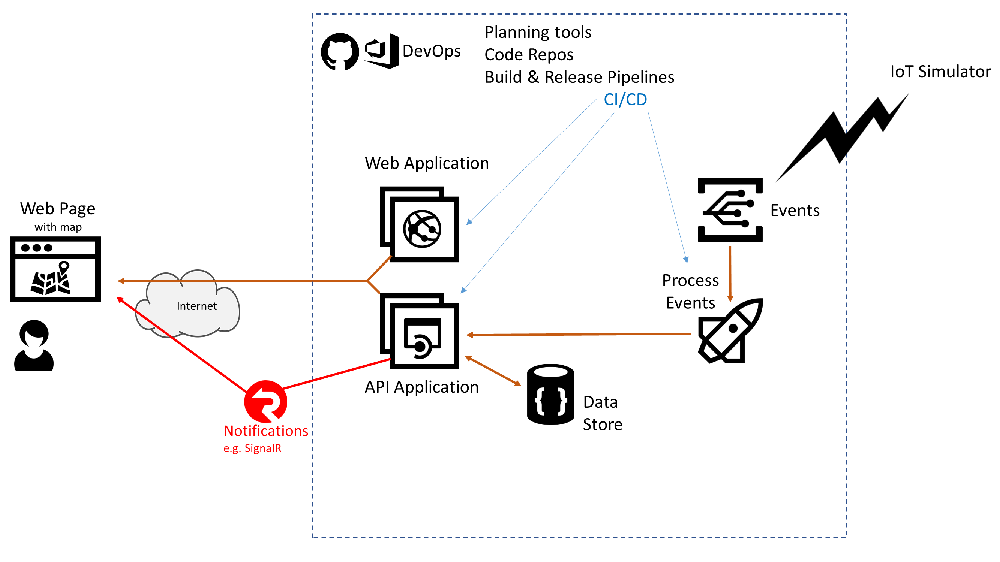

# Azure AppDev Challenge

## Day 2 - Notifications 

- Implement push notifications so that the web page doesn’t need to poll and cause excessive workload on the web servers / orchestrator / network
  - Consider Azure SignalR

Useful Resources:

- <https://docs.microsoft.com/azure/azure-signalr/>
