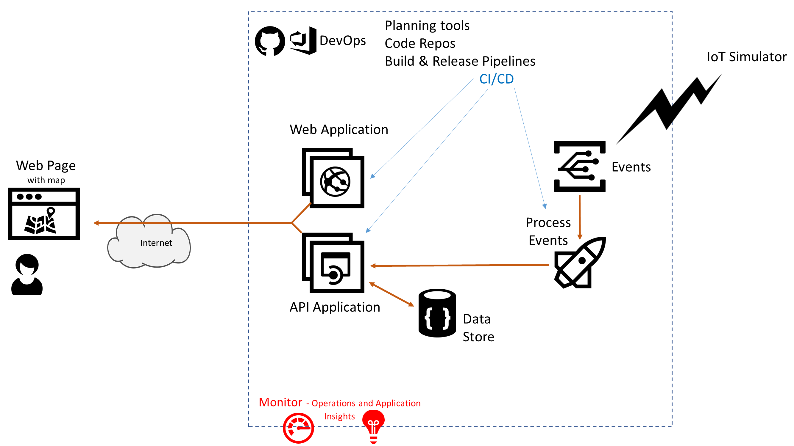

# Azure AppDev Challenge

## Day 2 - Heath & Performance Monitoring

- Implement Monitoring of application to track the monitor health, capacity and user behaviour
  - Infrastructure
  - Application telemetry
  - Security
- If your organisation uses third party monitoring solutions then consider using them e.g. Datadog, Dynatrace, etc.

Useful Resources

- <https://docs.microsoft.com/azure/azure-monitor/>
- <https://docs.microsoft.com/azure/azure-monitor/learn/quick-monitor-portal>
- <https://docs.microsoft.com/azure/security-center/>
- <https://docs.datadoghq.com/integrations/azure/>
- <https://www.dynatrace.com/technologies/azure-monitoring/>
