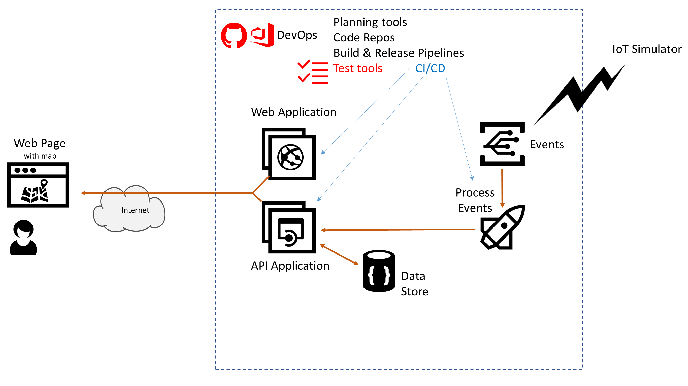

# Azure AppDev Challenge

## Day 2 - Automated Testing / Manual Test Plans 

- Amend the CI/CD pipelines to handle automated and manual testing
  - Functionality testing
  - Performance testing

Useful Resources:

- <https://docs.microsoft.com/azure/devops/test>
- <https://docs.microsoft.com/azure/devops/pipelines/test/getting-started-with-continuous-testing>
- <https://docs.microsoft.com/azure/load-testing/>
