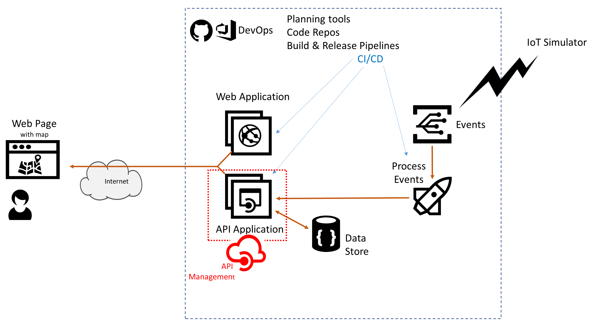

# Azure AppDev Challenge

## Day 2 - API Management

- API Management helps organizations publish APIs to external, partner and internal developers to unlock the potential of their data and services.
- Implement Azure API Management –
  - Amend applications to go via the APIM gateway
- Alternatively investigate using Azure Function Proxies
- Alternatively investigate third party offerings e.g. Kong, Ocelot, Ambassador, others…

Useful Resources:

- <https://docs.microsoft.com/azure/api-management/>
- <https://github.com/Azure/azure-api-management-devops-resource-kit>
- <https://marketplace.visualstudio.com/items?itemName=stephane-eyskens.apim>