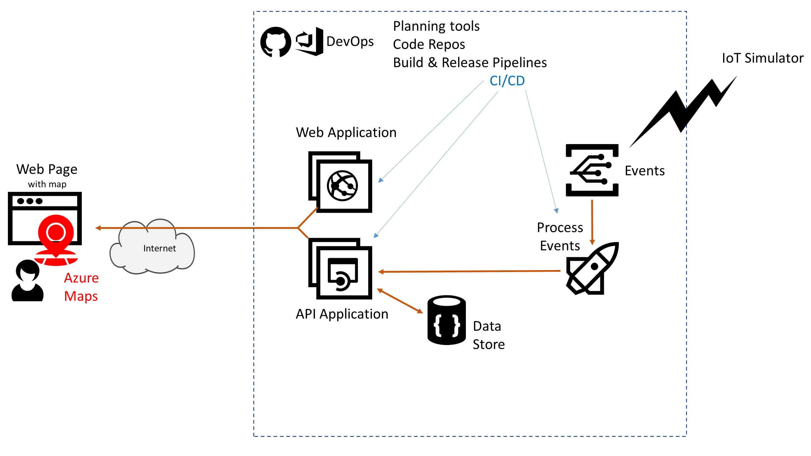

# Azure AppDev Challenge

## Day 2 - Enhanced Mapping 

- Enhance the Azure Maps functionality
- For example
  - add satellite imagery
  - add a toggle button to switch between
- Investigate the various mapping controls that can use Azure Maps content
  - Azure Maps, Leaflet, OpenLayers, ArcGis, Cesium,

Useful Resources:

- <https://docs.microsoft.com/azure/azure-maps/>
- <https://leafletjs.com/>
- <https://docs.microsoft.com/en-gb/azure/azure-maps/supported-map-styles>
- <https://github.com/Azure-Samples/AzureMapsCodeSamples>
