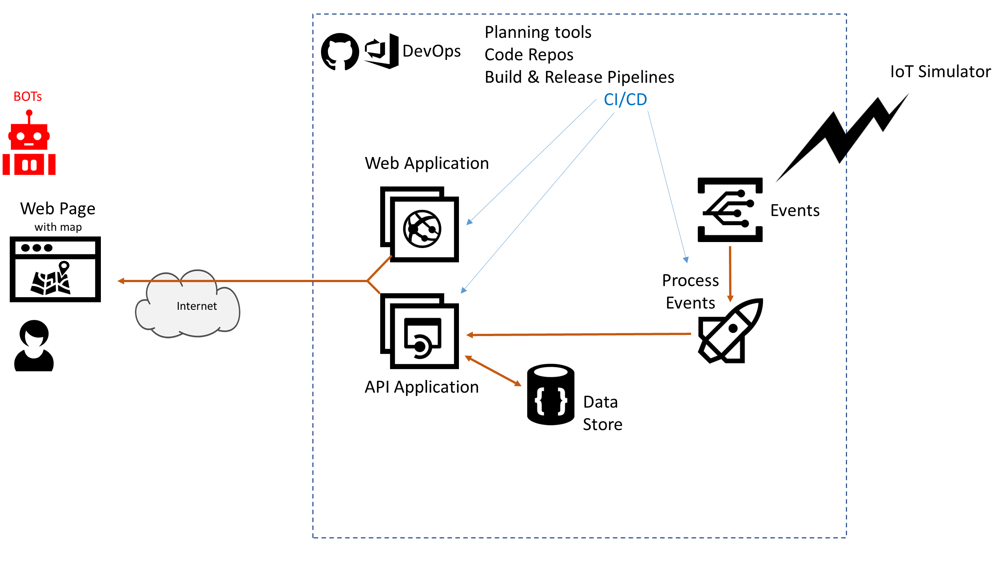

# Azure AppDev Challenge

## Day 2 - Chat BOTs

- Develop a Chat bot allowing a conversation / interrogate around the status of alarm
- For example
  - Get list of recent alarms or alarms close to a location
  - Reset Alarm status / set to Green

Useful Resources:

- <https://docs.microsoft.com/azure/bot-service/>
- <https://powervirtualagents.microsoft.com/>

