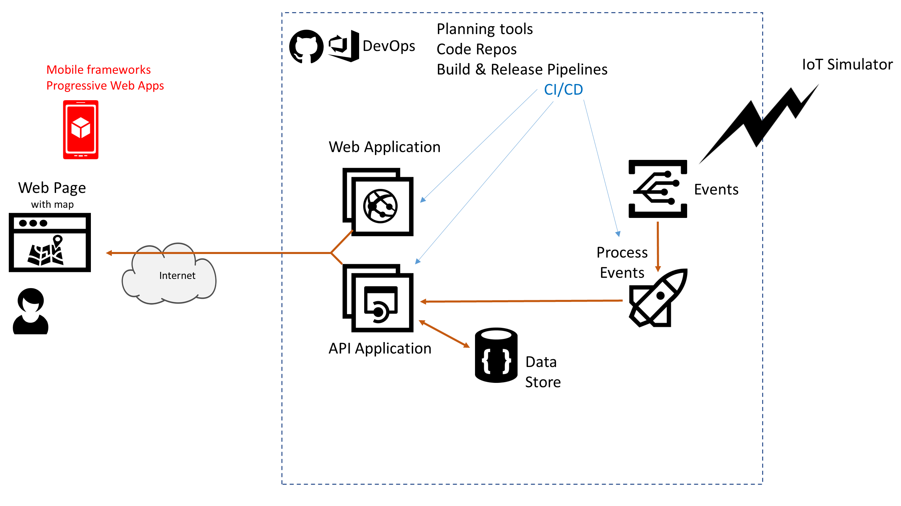

# Azure AppDev Challenge

## Day 2 - Mobile 

- Enhance the Web Application to work great on Mobile devices
- Options
  - use a framework like Xamarin
  - enhance the Web App to make use of PWA technologies
    

Useful Resources:

- <https://docs.microsoft.com/appcenter/>
- <https://dotnet.microsoft.com/apps/xamarin>
- <https://docs.microsoft.com/microsoft-edge/progressive-web-apps>
- <https://www.pwabuilder.com/>
