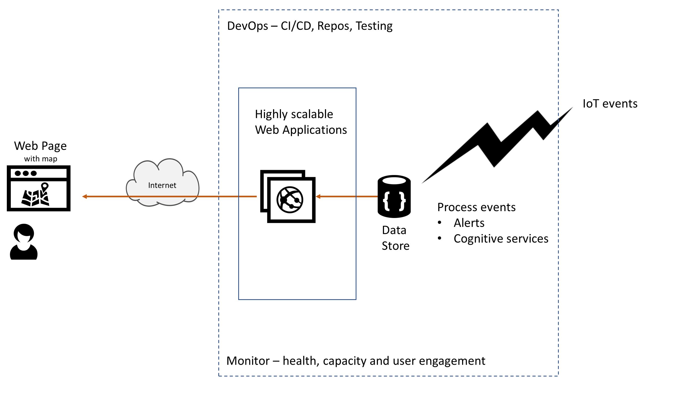

# Azure AppDev Challenge

## Challenge Scenario / Requirements

The challenge is to build a solution that addresses the following:

- the status of alarms is to be displayed on a live map hosted in a web page

- the status will be updated by IoT devices located in the remote locations

  -an IoT simulator is available

- workflow will be triggered for certain events

  -e.g. red alarms need different actions

- a devops strategy should be implemented with continuous integration / continuous deployment

- the solution must be resilient / scale if needed

- the solution must enable agility

- the solution should embrace cloud economics / be cost effective

