# Azure AppDev Challenge

## Appendix E – Report It 

An alternative to the IoT Simulator is the Report It app. This is a web app that can optionally installed as a PWA on a mobile device. It will take a photo and send an HTTP Post message to an endpoint containing photo, location and information.

The application is available as a container on Docker Hub. This can be installed as a Web App on Azure. It will require an Azure storage account to be created to store photos.

- Create a Storage Account – get the connection string
- Create an Azure Web App
  - Choose Linux & Containers
  - Container is `markharrison/thingsreportitapp:latest`
  - Configure:
    - ThingsDbConnectionString : to point to storage account
    - LogicAppEndpoint : to point to the LogicApp Webhook
  - Restart WebApp

Note that the payload the ReportIt app is sending is different from the IoT simulator. Also, it doesn’t include metadata information that is required by Event Hubs – so just use a new Logic App with a webhook trigger.  Alternatively use an Azure Function.

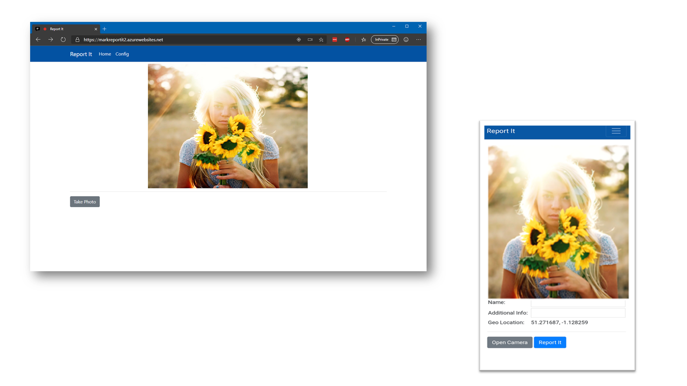

## Installation screenshots

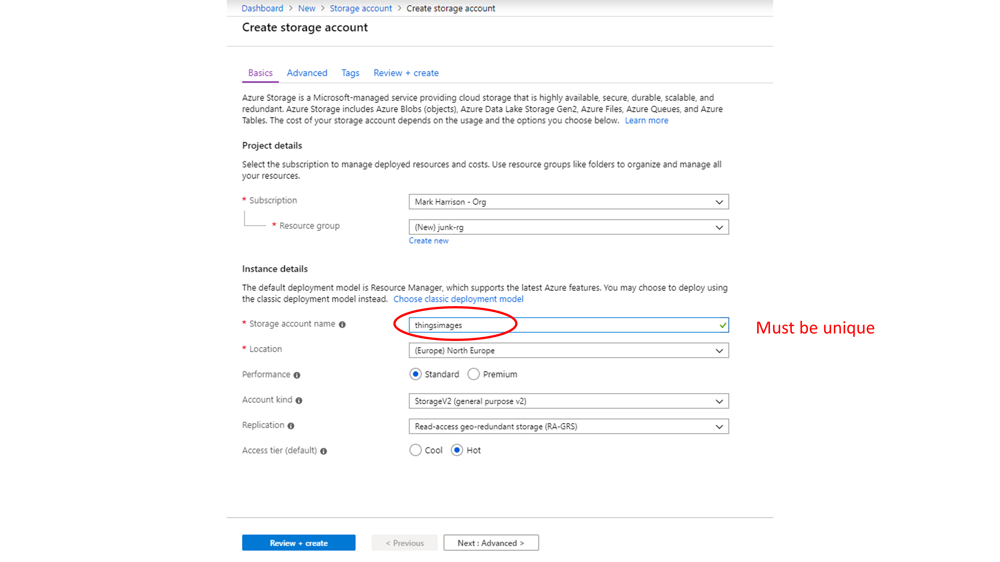

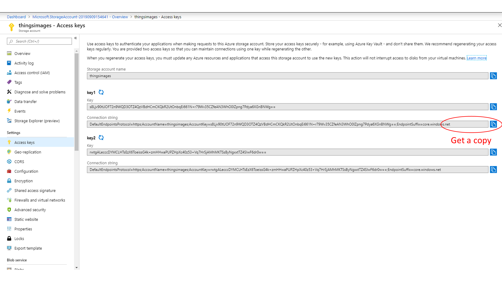

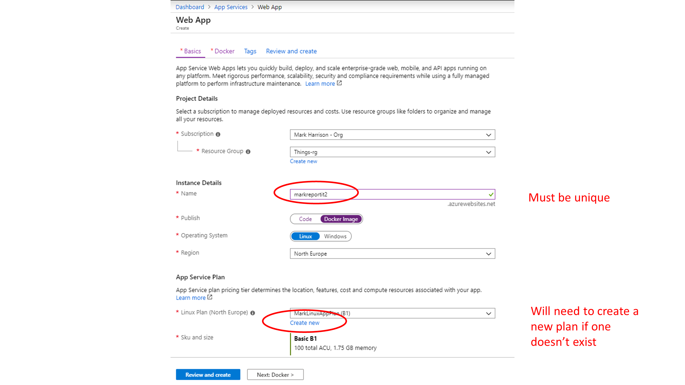

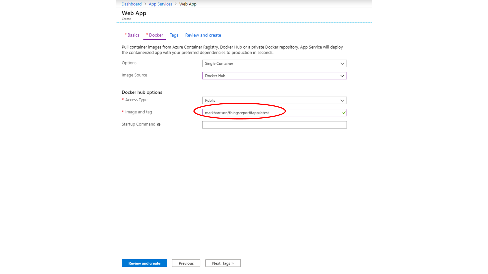

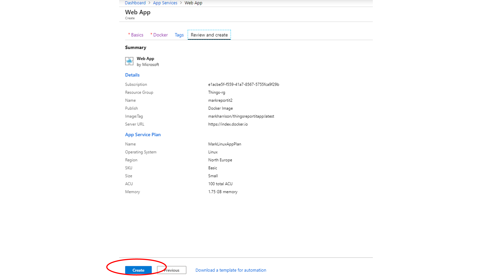

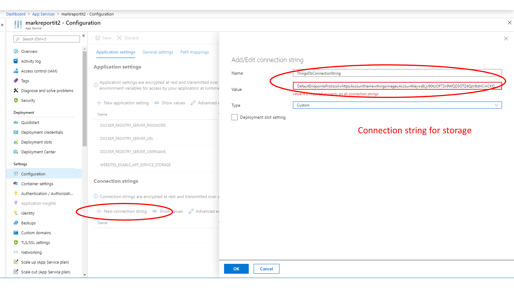

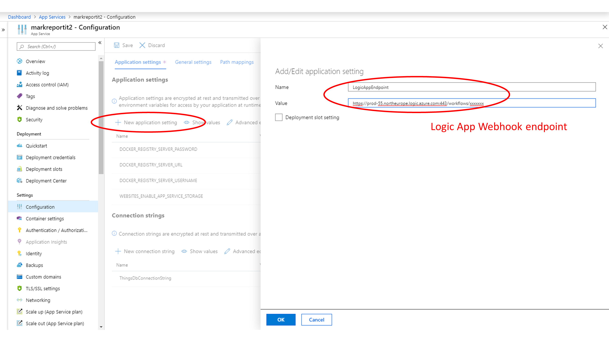

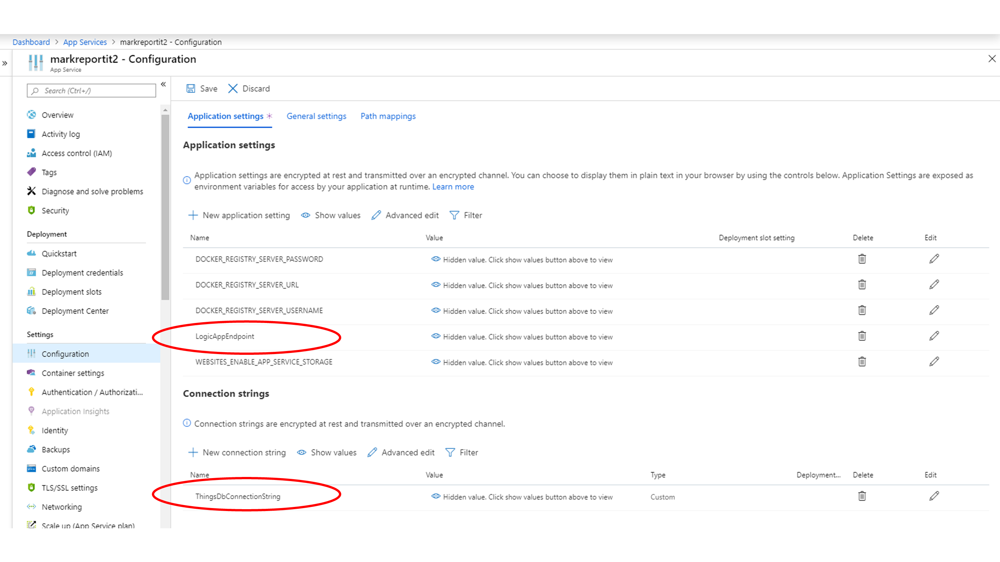

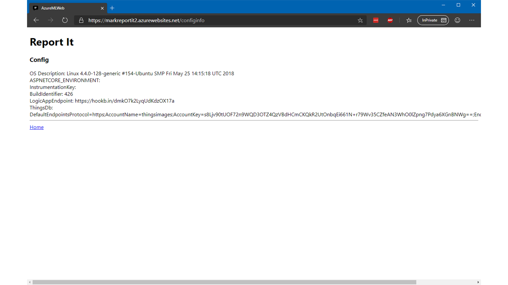

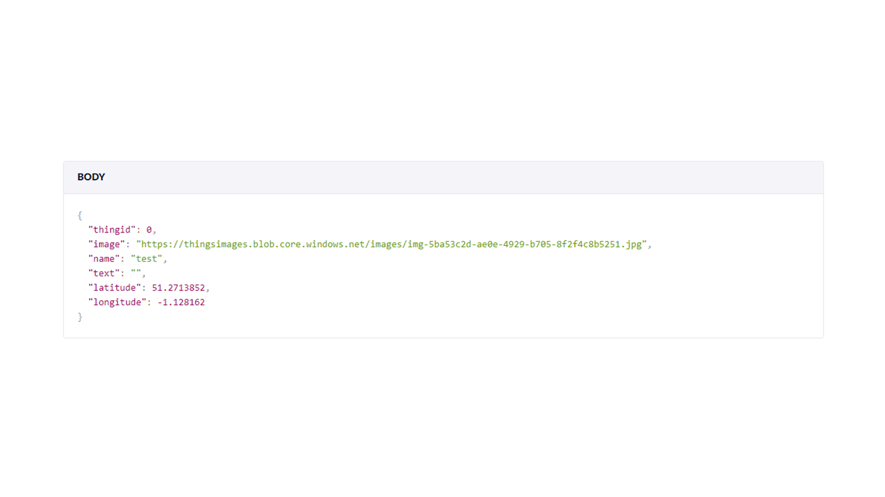
