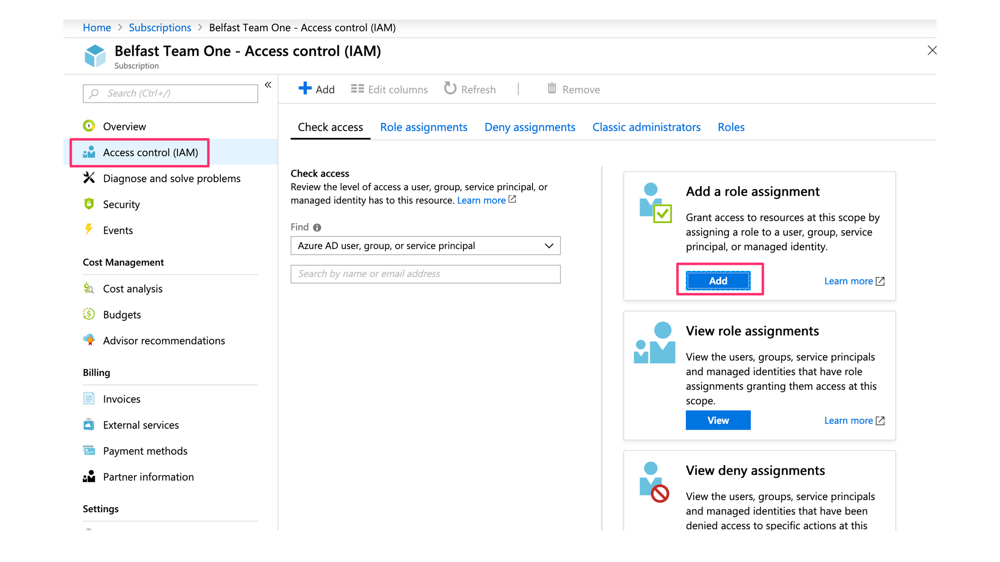
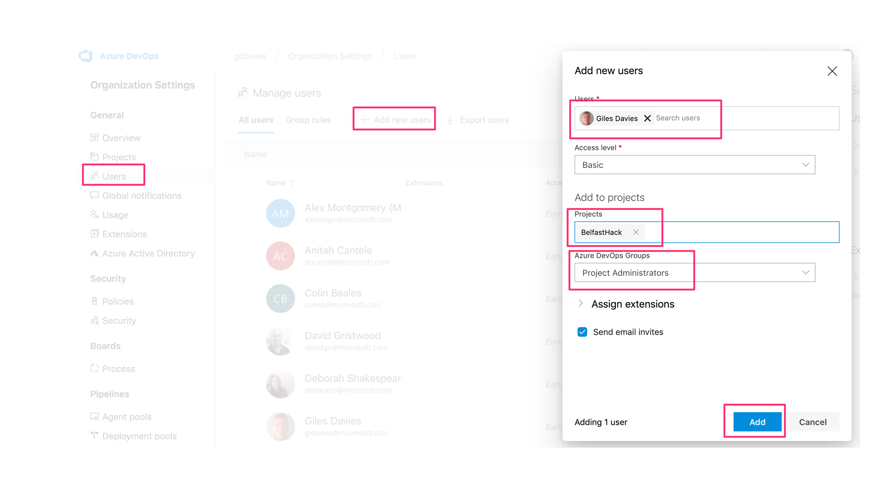

# Azure AppDev Challenge

## Appendix F - Azure subscription

### Setting up the subscription

One person should log into the Azure Portal (portal.azure.com) with the provided user id and password.

Navigate to the subscriptions area within the Portal (e.g. search in All Services):

Select the team subscription and open it. Select Access control (IAM) and then Add role assignment:

Then add each member of the team to the subscription with the role of Owner. Each team member should be added using a Microsoft account or work/organisation account as their id:

Each team member will then get an email at that address, which they must verify.

### Adding users to an Azure DevOps organisation

In Azure DevOps go into the Organization settings (bottom left corner) and then select Add new users. Add each team member as a basic user (you can add more than one at a time/all of the team in one go) and set the Azure DevOps Groups to Project Administrators (you wouldn’t normally do this but for the purposes of the hack this allows everyone full access in the project):

Note if any of the team members have a Visual Studio Subscription (MSDN) associated with their email then set the Access Level to Visual Studio Subscription and it will not consume a free basic licence.
