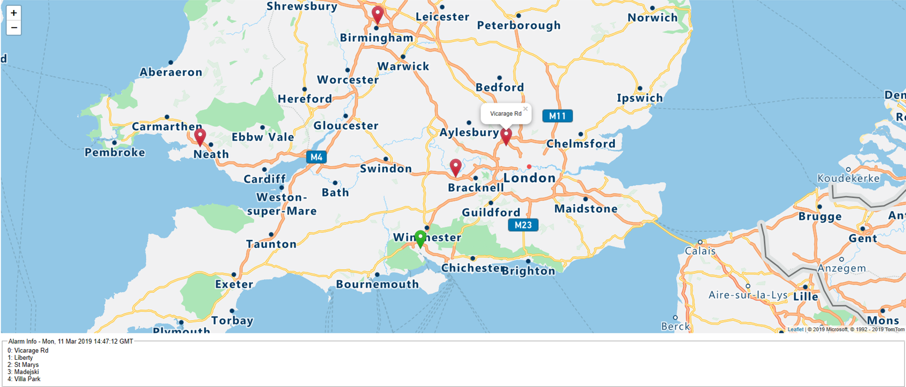

# Azure AppDev Challenge

## Day 1 - Task 2

- Appendix A contains an HTML page / data file – this is an example that illustrates how to display a map with pins using Azure Maps
- Create an Azure Maps API key amend the web page logic to use the new key

Useful Resources:

- [https://docs.microsoft.com/azure/azure-maps/](<https://docs.microsoft.com/azure/azure-maps/>)
- [https://leafletjs.com/](<https://leafletjs.com/>)

