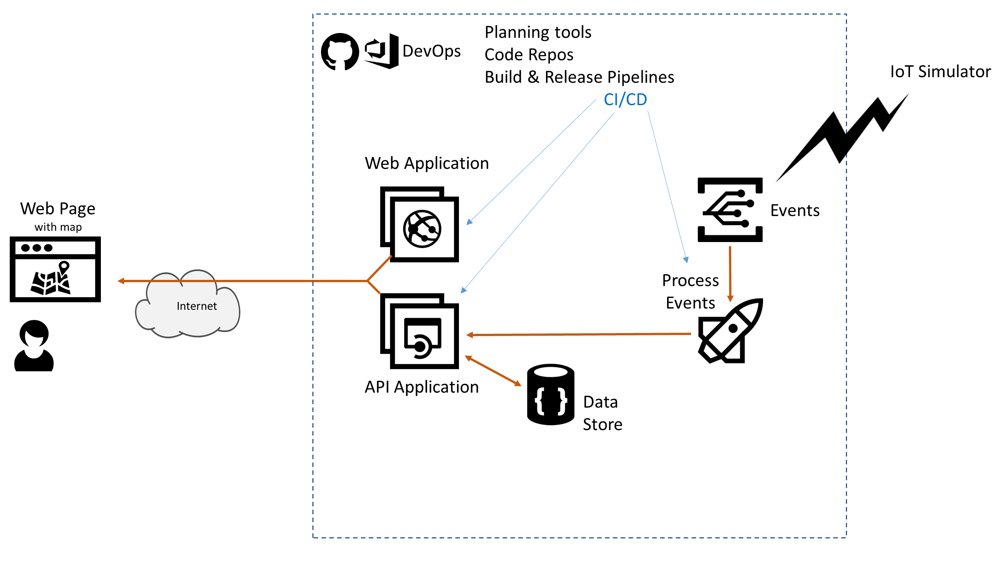

# Azure AppDev Challenge

## Day 1 - Task 9

- Use Serverless functionality to receive and process the IoT status messages
  - e.g. Azure Logic Apps
- Workflow:
  - Triggered by events arriving
  - Processing to call API application to update alarm status in datastore (if using Logic apps then use a Custom Connector)
- Amend Web Application to allow an operator to reset an alarm
  - Call API application to set Status = Green

Useful Resources:

- [https://docs.microsoft.com/azure/logic-apps/](<https://docs.microsoft.com/azure/logic-apps/>)
- [https://docs.microsoft.com/azure/azure-functions/](<https://docs.microsoft.com/azure/azure-functions/>)
- [https://docs.microsoft.com/connectors/custom-connectors/create-logic-apps-connector](<https://docs.microsoft.com/connectors/custom-connectors/create-logic-apps-connector>)
- [https://docs.microsoft.com/connectors/custom-connectors/define-openapi-definition](<https://docs.microsoft.com/connectors/custom-connectors/define-openapi-definition>)
