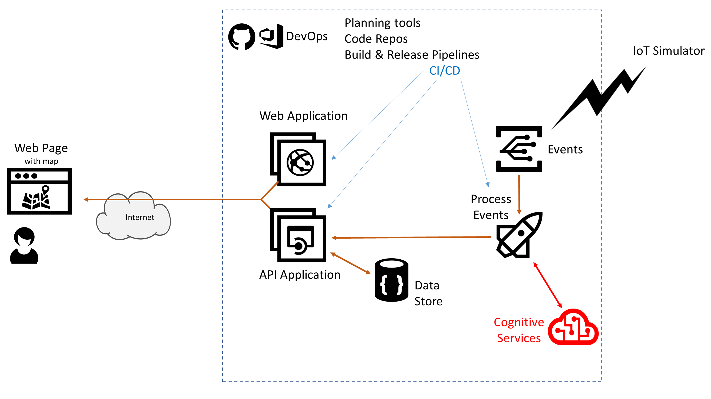

# Azure AppDev Challenge

## Day 2 - Cognitive Services / Computer Vision AI

- Update event processing to use cognitive services
  - IOT alarm messages will include a link to a photo
  - Use photo recognition to distinguish between intruders and false positives  
        e.g. detect Humans as opposed to Animals
- Update datastore appropriately
  -Status = Red if humans detected
  -Status = Amber if false alarm

Useful Resources:

- [https://docs.microsoft.com/azure/cognitive-services/](<https://docs.microsoft.com/azure/cognitive-services/>)
- [https://docs.microsoft.com/azure/cognitive-services/computer-vision/home](<https://docs.microsoft.com/azure/cognitive-services/computer-vision/home>)
