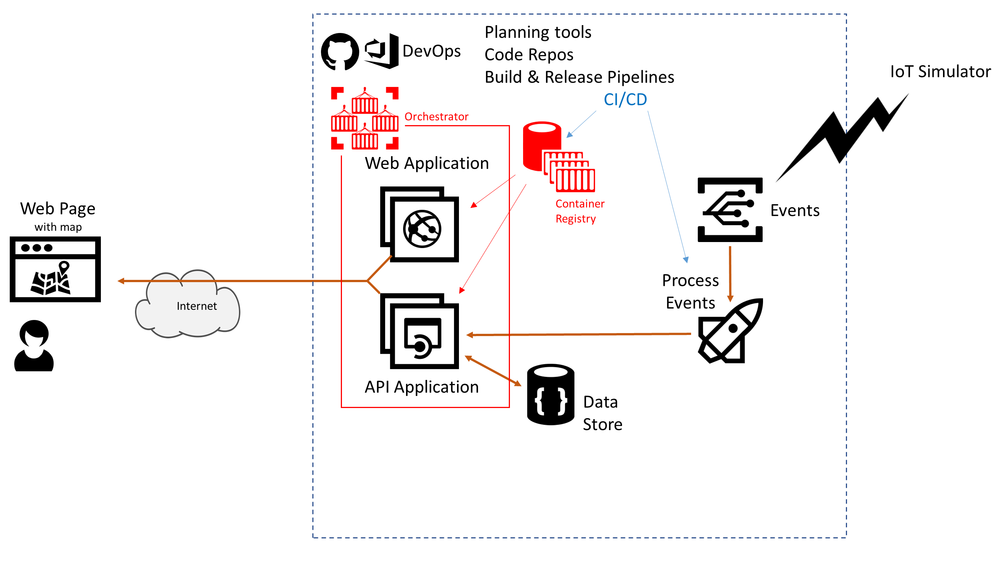

# Azure AppDev Challenge

## Day 2 - Microservices & scale-out

The Web / API applications are rather simple, but now consider that they are to be part of much larger microservices based architecture – and the requirement is be able to scale each microservice independently. These needs an orchestrator such as Kubernetes, SF, SF Mesh, other

- Convert Web/API applications to run as Docker containers
- Deploy into an Orchestrator – such as Kubernetes, SF, SF Mesh, other
  - For the purpose of this hack and to be using Docker containers – using Web Apps for Containers is an OK approach.
- Amend CI build pipelines to build Docker images and push to Container Registry
- Amend CD release pipelines to deploy latest containers to orchestrator of choice
- Handle Scale – ramp up the load from IoT simulator (more map locations / faster updates)
  - Ensure Orchestrator is configured to auto-scale

Useful Resources:

- [https://docs.microsoft.com/azure/container-registry/](<https://docs.microsoft.com/azure/container-registry/>)
- [https://docs.microsoft.com/aspnet/core/host-and-deploy/docker/](<https://docs.microsoft.com/aspnet/core/host-and-deploy/docker/>)
- [https://docs.microsoft.com/azure/aks/](<https://docs.microsoft.com/azure/aks/>)
- [https://docs.microsoft.com/azure/app-service/containers/tutorial-custom-docker-image](<https://docs.microsoft.com/azure/app-service/containers/tutorial-custom-docker-image>)
