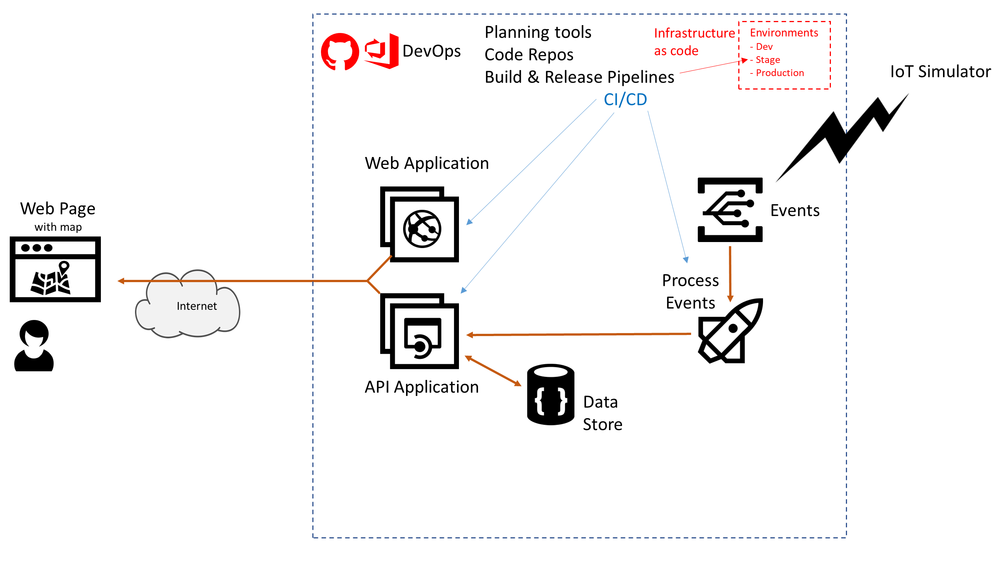

# Azure AppDev Challenge

## Day 2 - Infrastructure as code

- Implement CI/CD pipelines to handle ‘infrastructure as code’
- Amend the CI/CD pipelines to handle multiple environments
  - Dev
  - Stage
  - Production

Useful Resources:

- [https://docs.microsoft.com/azure/devops/learn/what-is-infrastructure-as-code](<https://docs.microsoft.com/azure/devops/learn/what-is-infrastructure-as-code>)
- [https://docs.microsoft.com/azure/governance/](<https://docs.microsoft.com/azure/governance/>)
- [https://docs.microsoft.com/azure/azure-resource-manager/resource-group-overview](<https://docs.microsoft.com/azure/azure-resource-manager/resource-group-overview>)
- [https://docs.microsoft.com/azure/azure-resource-manager/bicep/overview](<https://docs.microsoft.com/azure/azure-resource-manager/bicep/overview>)
- [https://docs.microsoft.com/azure/azure-resource-manager/templates/overview](<https://docs.microsoft.com/azure/azure-resource-manager/templates/overview>)
- [https://terraform.io](<https://terraform.io>)
